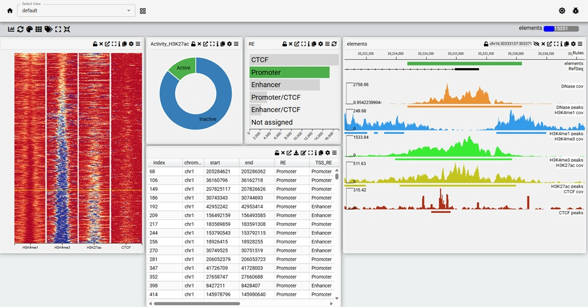

## Installing MDV Tools
First install MDVTools, which at the moment is only available at testpypi
```bash
pip install --index-url https://test.pypi.org/simple/ \
            --extra-index-url https://pypi.org/simple/ mdvtools
```

You will need htslib installed as bgzip and tabix are required


## Creating A Visualization
Then following python code will create an MDV project from the output of the pipeline


```python
from mdvtools.conversions import create_regulamentary_project_from_pipeline
p =create_regulamentary_project_from_pipeline(
    # 1 folder for the MDV Project
    "/path/to/myproject",
    # 2 path to the regulamentary config
    "/path/to/config.yaml",
    # 3 path to regulamentary's output 
    "/path/to/output",
    # path to the atac/DNase BigWig
    atac_bw="input/bigwigs/astrocyte_DNase_chr21.bw" 
    )
p.set_editable(True)
p.serve()

```

This will create a visualization and serve it an a local server on port 5050. Open a browser and point it to localhost:5050 to view it 

### Required Parameters
1) The path to a folder that will house the MDV project, one will be created if it it does not exist - you need write access this folder
2) The path to the yaml config you used to run the regulamentary pipeline with. This contains information about the location of the track files used in the pipeline,
3) The path to the output of pipeline , which should contain the ATAC, merge and CTCF folders.

### Optional Parameters

* atac_bw - the path to the ATAC/DNase bigwig used to call peaks (which is not actually required for the pipeline) / If the pipeline was run with bigwig files than the one specified in the pipeline config will be used and this parameter can be omitted.
* peaks - the peaks used to create the MDV project, either merged, ATAC or CTCF. Default is merged
* genome - the genome can be ascertained if 'remove_blacklist' is present in the config. Can be hg38 or mm10. Default is hg38
* openchrom - which method was used identify open chromatin. Either DNase or ATAC.This is only used for labels. Default is DNAse


## Visualizing the Project


```python
from mdvtools.mdvproject import MDVProject
p = MDVProject("/path/to/myproject")
p.serve()

```
By default the local server runs on port 5050, but this can be changed with the 'port' parameter. Just open a browser 

The default view consists of a table with all the data about each regulatory element as well as a genome browser and an interactive  metaplot (deeptools heatmap). The data can be filtered  through any  the charts and the metaplot and table will be updated accordingly. You can zoom into an element in the browser by either clicking on it in the table or on the metaplot.

The metaplot can be zoomed by using the mouse wheel and panned by holding down the middle/right-hand mouse button and moving the mouse. A dialog can be accessed via the settings (cog) icon on the metaplot, where you can adjust the color of the map and group/sort the elements.


## Creating a Web Page
You can create a 'static' version of the visualization which does not require any backend logic to display and can therefore be displayed as a web page on many server architectures e.g. github.io

To do this run the following python code:-
```python
from mdvtools.mdvproject import MDVProject
p = MDVProject("/path/to/myproject")
p.convert_to_static_page("myproject")
```
A folder (myproject) will be created in the current working directory and should be moved to the  public directory of a webserver where it would be accessed with the following url:-

https://myserver.com/myproject


## Available Visualizations
The following visualizations are publicly available

B-cells	https://mdv.molbiol.ox.ac.uk//projects/mdv_project/7586

cardiac-muscle-cell	https://mdv.molbiol.ox.ac.uk//projects/mdv_project/7587

endothelial-cell-of-umbilical-vein	https://mdv.molbiol.ox.ac.uk//projects/mdv_project/7588

keratinocyte	https://mdv.molbiol.ox.ac.uk//projects/mdv_project/7589

natural-killer-cell	https://mdv.molbiol.ox.ac.uk//projects/mdv_project/7590

CD4-positive	https://mdv.molbiol.ox.ac.uk//projects/mdv_project/7591

fibroblast-of-lung	https://mdv.molbiol.ox.ac.uk//projects/mdv_project/7592

CD14-positive-monocyte	https://mdv.molbiol.ox.ac.uk//projects/mdv_project/7593

fibroblast-of-dermis	https://mdv.molbiol.ox.ac.uk//projects/mdv_project/7594

osteoblast	https://mdv.molbiol.ox.ac.uk//projects/mdv_project/7595

skeletal-muscle-myoblast	https://mdv.molbiol.ox.ac.uk//projects/mdv_project/7596

mammary-epithelial-cell	https://mdv.molbiol.ox.ac.uk//projects/mdv_project/7597

astrocyte	https://mdv.molbiol.ox.ac.uk//projects/mdv_project/7598